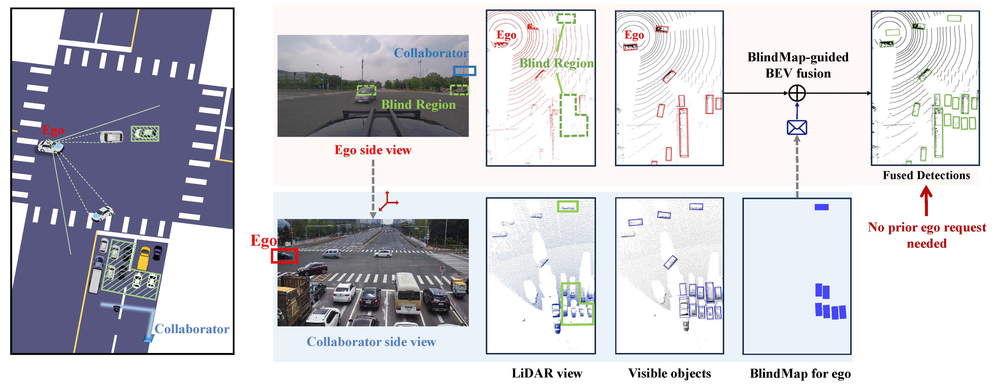

# BlindMap: Explicit Blind-Area Prediction and Request-Free Communication for Efficient Cooperative Perception
This repository provides the official implementation of **BlindMap**, a new cooperative perception framework featuring **explicit blind-area prediction, request-free communication, and ultra-low collaboration latency**, accepted by **IEEE INFOCOM 2026**.

BlindMap is designed for real-time, deadline-constrained V2X collaborative perception, addressing the two fundamental limitations of prior systems:

- Ego-centric region selection is inaccurate.
Existing methods rely on uncertainty maps or attention—both ego-centric, unable to understand what is actually occluded from the ego viewpoint.

- Communication depends on request-response loops.
This tight coupling between ego perception → request → collaborator response makes global collaboration latency uncontrollable.

BlindMap introduces a new communication paradigm:

>Collaborators proactively predict the ego’s blind areas → directly transmit useful features → no ego request needed.




## Repo Feature

- Modality Support
  - [x] LiDAR


- Dataset Support
  - [x] OPV2V
  - [x] V2XSet
  - [x] DAIR-V2X-C

- Detector Support
  - [x] PointPillars (LiDAR)
  - [x] SECOND (LiDAR)
  - [x] Pixor (LiDAR)
  - [x] VoxelNet (LiDAR)
  - [x] Lift-Splat-Shoot (Camera)

- multiple collaborative perception methods
  - [x] [Attentive Fusion [ICRA2022]](https://arxiv.org/abs/2109.07644)
  - [x] [Cooper [ICDCS]](https://arxiv.org/abs/1905.05265)
  - [x] [F-Cooper [SEC2019]](https://arxiv.org/abs/1909.06459)
  - [x] [V2VNet [ECCV2022]](https://arxiv.org/abs/2008.07519)
  - [x] [DiscoNet [NeurIPS2022]](https://arxiv.org/abs/2111.00643)
  - [x] [V2X-ViT [ECCV2022]](https://github.com/DerrickXuNu/v2x-vit)
  - [x] [Where2comm [Neurips 2022]](https://github.com/MediaBrain-SJTU/Where2comm.git)
  - [x] [How2comm [NeurIPS 2023]](https://github.com/ydk122024/How2comm.git)
  - [x] [CodeFilling [CVPR 2024]](https://github.com/PhyllisH/CodeFilling.git)


## Checkpoints

Pretrained BlindMap checkpoints are available on Hugging Face: [Davinsteinsudas/BlindMap](https://huggingface.co/Davinsteinsudas/BlindMap).
The checkpoint release includes model weights, configuration files, and source result logs; each checkpoint directory follows the OpenCOOD-style layout and can be passed directly as `--model_dir` for inference.

## Data Preparation
- OPV2V: Please refer to [this repo](https://github.com/DerrickXuNu/OpenCOOD). 
- OPV2V-H: We store our data in [Huggingface Hub](https://huggingface.co/datasets/yifanlu/OPV2V-H). Please refer to [Downloading datasets](https://huggingface.co/docs/hub/datasets-downloading) tutorial for the usage.
- V2XSet: Please refer to [this repo](https://github.com/DerrickXuNu/v2x-vit).
- DAIR-V2X-C: Download the data from [this page](https://thudair.baai.ac.cn/index). We use complemented annotation, so please also follow the instruction of [this page](https://siheng-chen.github.io/dataset/dair-v2x-c-complemented/). 


Create a `dataset` folder under `BlindMap` and put your data there. Make the naming and structure consistent with the following. 
**Note:** The `blindmap_history` folder is automatically generated by the script `BlindMap/opencood/data_utils/datasets/basedataset/blindmap_gen.py`. Since the **DAIR-V2X-C** dataset does not contain temporal information, no blindmap_history data will be generated for it.
```
BlindMap/dataset
. 
├── my_dair_v2x 
│   ├── v2x_c
│   ├── v2x_i
│   └── v2x_v
├── OPV2V
│   ├── blindmap_history
│   ├── test
│   ├── train
│   └── validate
├── V2XSET
    ├── blindmap_history
    ├── test
    ├── train
    └── validate
```


## Installation
### Step 1: Basic Installation
```bash
conda create -n BlindMap python=3.8
conda activate BlindMap
# install pytorch. 
conda create -n coalign python=3.8 pytorch==1.12.0 torchvision==0.13.0 torchaudio==0.12.0 cudatoolkit=11.6 -c pytorch -c conda-forge
# install dependency
pip install -r requirements.txt
# install this project. It's OK if EasyInstallDeprecationWarning shows up.
python setup.py develop
```


### Step 2: Install Spconv (1.2.1 or 2.x)
We use spconv 1.2.1 or spconv 2.x to generate voxel features. spconv 2.x has much convenient installation, but our checkpoints are stored in spconv 1.2.1 and they are not compatible.

To install **spconv 2.x**, check the [table](https://github.com/traveller59/spconv#spconv-spatially-sparse-convolution-library) to run the installation command. For example we have cudatoolkit 11.6, then we should run
```bash
pip install spconv-cu116 # match your cudatoolkit version
```

To install **spconv 1.2.1**, please follow the guide in https://github.com/traveller59/spconv/tree/v1.2.1.
You can also get a detailed installation guide in [CoAlign Installation Doc](https://udtkdfu8mk.feishu.cn/docx/LlMpdu3pNoCS94xxhjMcOWIynie#doxcn5rISC6NcfXIUnWFnXhTEzd).


### Step 3: Bbx IoU cuda version compile
Install bbx nms calculation cuda version
  
```bash
python opencood/utils/setup.py build_ext --inplace
```

### Step 4: Dependencies for FPV-RCNN (optional)
Install the dependencies for fpv-rcnn.
  
```bash
cd BlindMap
python opencood/pcdet_utils/setup.py build_ext --inplace
```


---
To align with our agent-type assignment in our experiments, please make a copy of the assignment file under the logs folder
```bash
# in BlindMap directory
mkdir opencood/logs
cp -r opencood/modality_assign opencood/logs/heter_modality_assign
```


## Basic Train / Test Command
These training and testing instructions apply to all end-to-end training methods. 

### Train the model
We uses yaml file to configure all the parameters for training. To train your own model
from scratch or a continued checkpoint, run the following commonds:
```python
python opencood/tools/train.py -y ${CONFIG_FILE} [--model_dir ${CHECKPOINT_FOLDER}]
```
Arguments Explanation:
- `-y` or `hypes_yaml` : the path of the training configuration file, e.g. `opencood/hypes_yaml/opv2v/LiDAROnly/lidar_pyramid_blindmap_noise.yaml`, meaning you want to train
a BlindMap model. **We elaborate each entry of the yaml in the exemplar config file `opencood/hypes_yaml/exemplar.yaml`.**
- `model_dir` (optional) : the path of the checkpoints. This is used to fine-tune or continue-training. When the `model_dir` is
given, the trainer will discard the `hypes_yaml` and load the `config.yaml` in the checkpoint folder. In this case, ${CONFIG_FILE} can be `None`,


### Test the model
```python
python opencood/tools/inference.py --model_dir ${CHECKPOINT_FOLDER} [--fusion_method intermediate] [--comm_volume_MB 1] [--comm_thre 0.1] 
```
- `inference.py` has more optional args, you can inspect into this file.
- `[--fusion_method intermediate]` the default fusion method is intermediate fusion. According to your fusion strategy in training, available fusion_method can be:
  - **single**: only ego agent's detection, only ego's gt box. *[only for late fusion dataset]*
  - **no**: only ego agent's detection, all agents' fused gt box.  *[only for late fusion dataset]*
  - **late**: late fusion detection from all agents, all agents' fused gt box.  *[only for late fusion dataset]*
  - **early**: early fusion detection from all agents, all agents' fused gt box. *[only for early fusion dataset]*
  - **intermediate**: intermediate fusion detection from all agents, all agents' fused gt box. *[only for intermediate fusion dataset]*
- `[--comm_volume_MB 1]`defaults to 1, meaning the communication payload is limited to 1 MB.
- `[--comm_thre 0.1]` defaults to 0, meaning the model will select and transmit features whose communication confidence values are greater than 0.
## Acknowledgements
Thank for the excellent cooperative perception codebases [OpenCOOD](https://github.com/DerrickXuNu/OpenCOOD).

Thank for the excellent cooperative perception datasets [DAIR-V2X](https://thudair.baai.ac.cn/index), [OPV2V](https://mobility-lab.seas.ucla.edu/opv2v/) and [V2X-SIM](https://ai4ce.github.io/V2X-Sim/).


## Citation
```

@inproceedings{your2026blindmap,
  title={BlindMap: Explicit Blind-Area Prediction and Request-Free Communication for Efficient Cooperative Perception},
  author={Zhu, Zhenhan and Jiang, Yihang and Zhao, Yanchao},
  booktitle={Proceedings of IEEE INFOCOM},
  year={2026},
  note={To appear}
}
```
